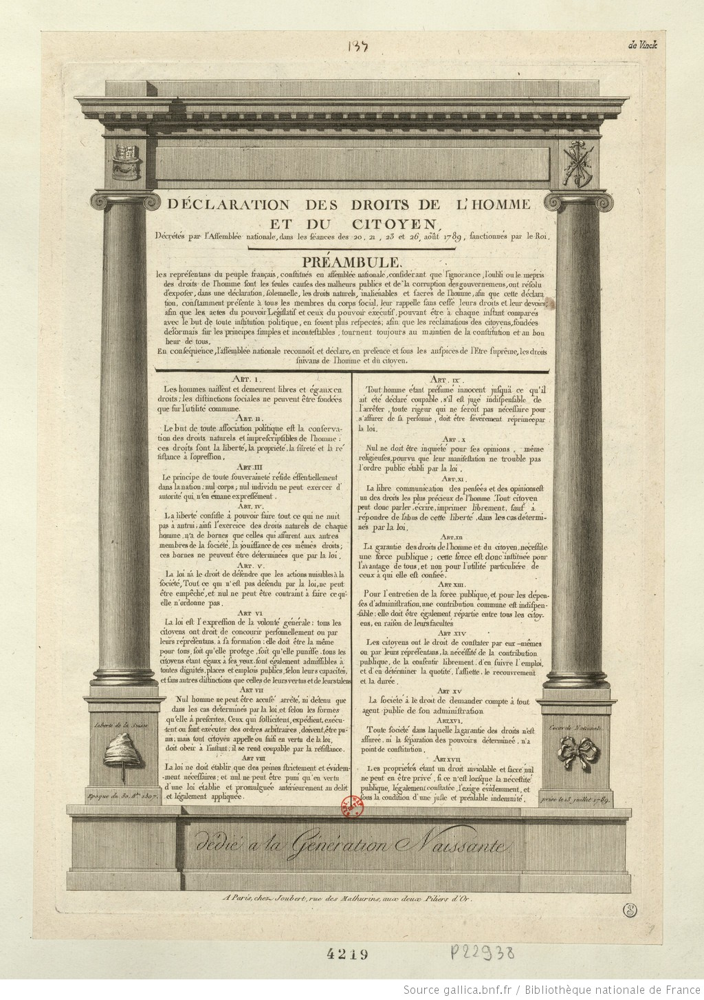
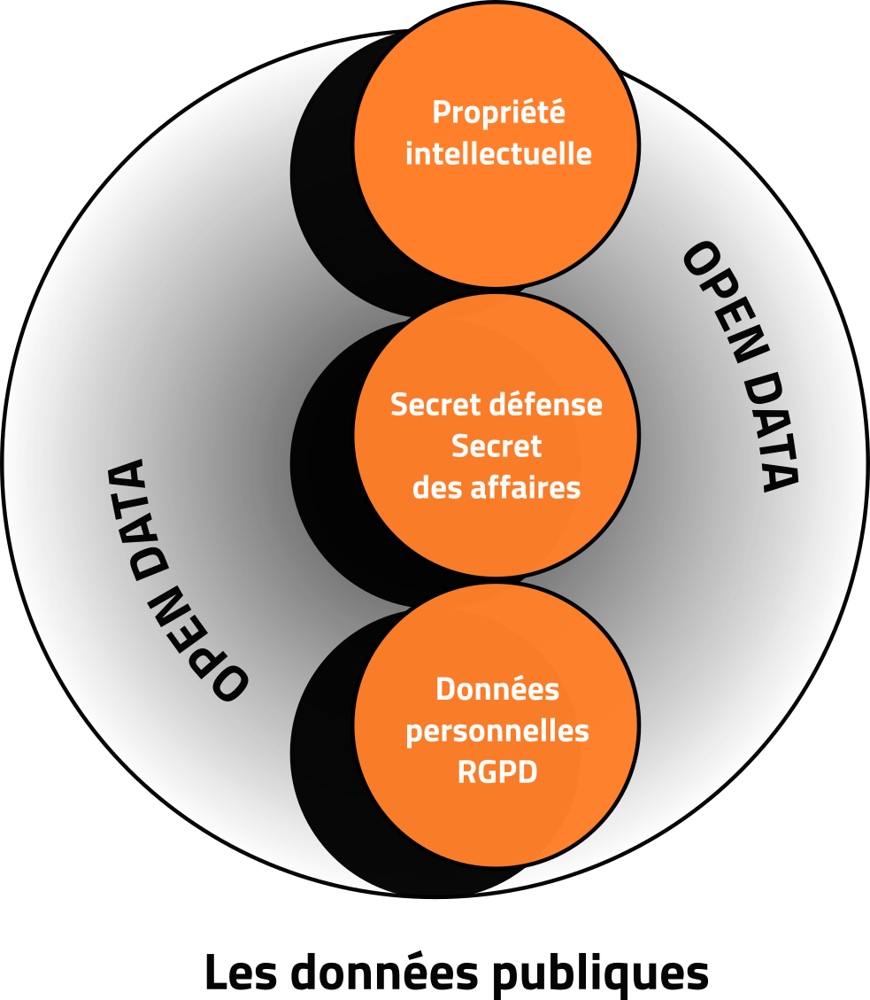
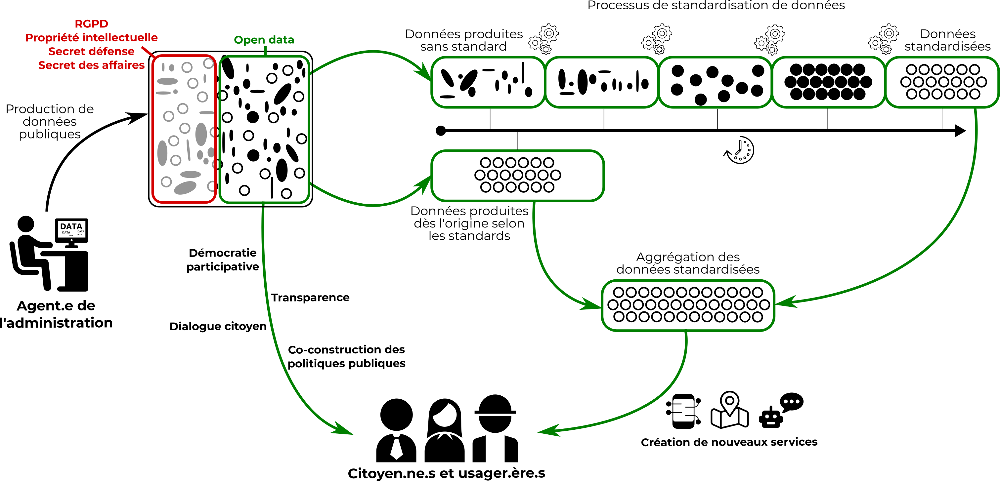
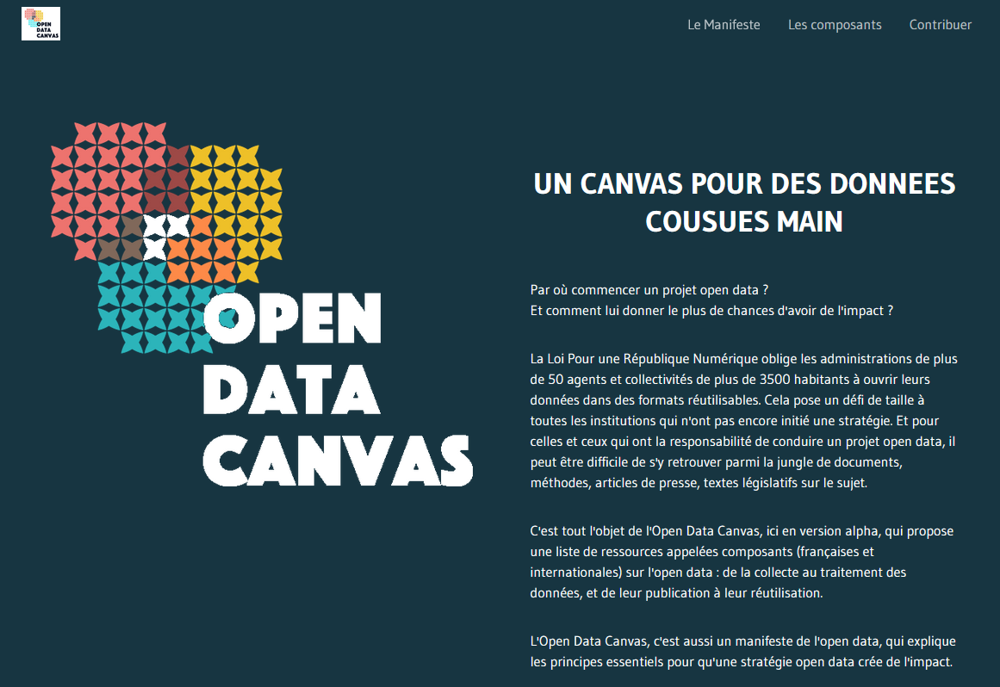
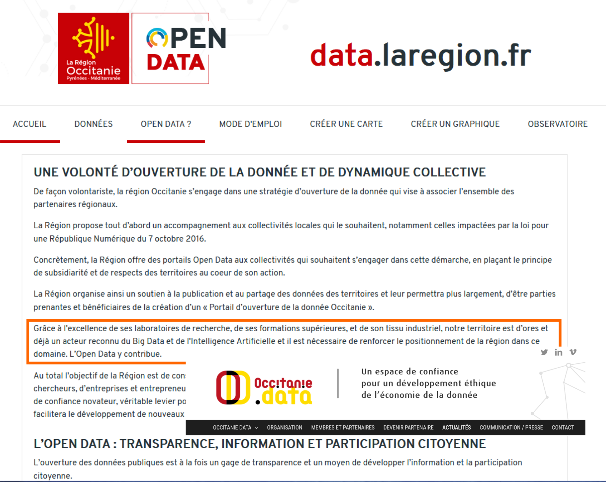
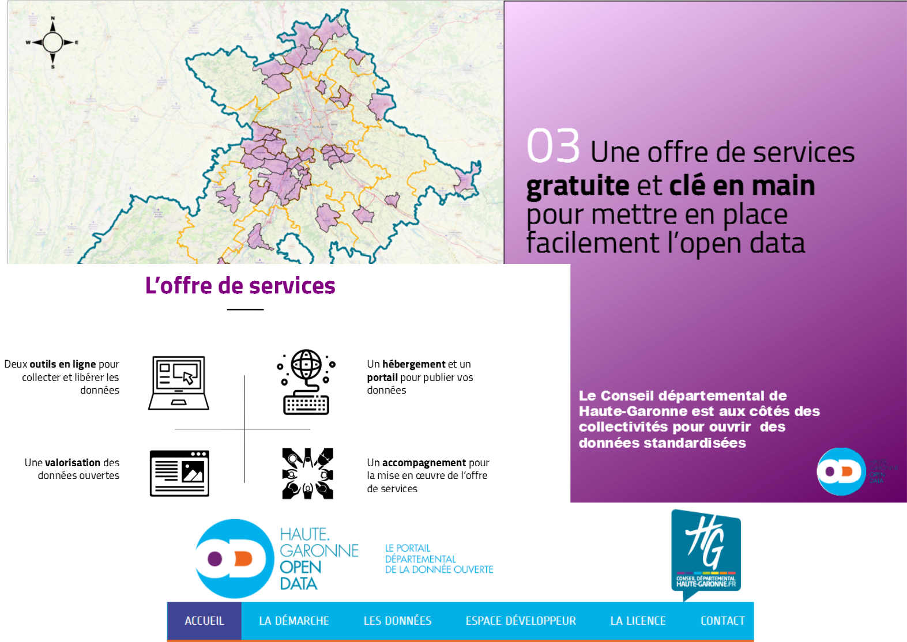
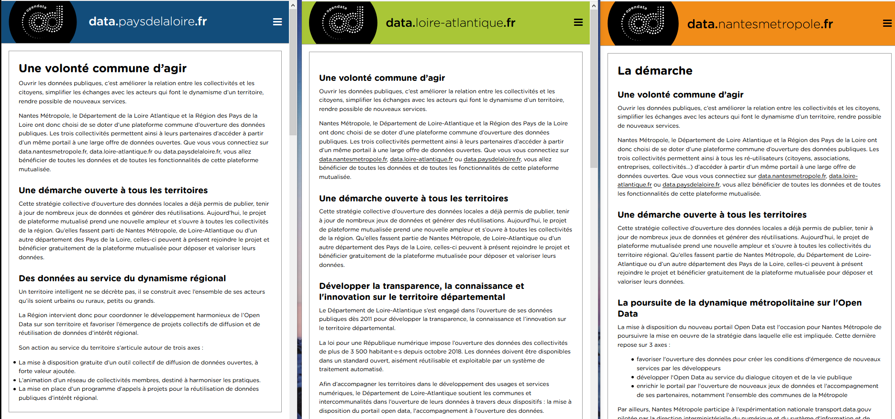
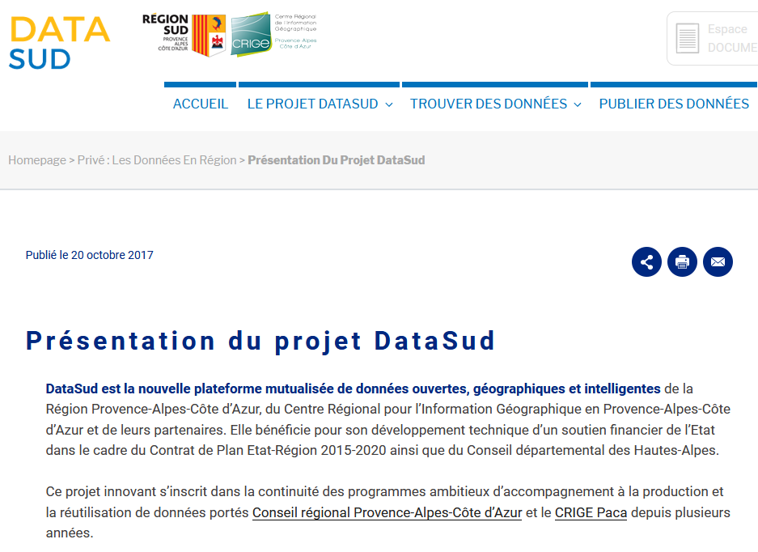

layout: true
  

`r paste0("
", params$event, " 

")` 

---

class: center, middle

Ces slides en ligne : `r paste0("http://datactivist.coop/", params$slug)`

Sources : `r paste0("https://github.com/datactivist/", params$slug)`

Les productions de Datactivist sont librement réutilisables selon les termes de la licence [Creative Commons 4.0 BY-SA](https://creativecommons.org/licenses/by-sa/4.0/legalcode.fr).

 
 

---

### We .red[open data], we make them .red[useful]

- Datactivist est un .red[**pure player de l’open data**] créé en 2016, par Samuel Goëta et Joël Gombin.

- Se positionnant sur .red[**toutes les étapes du travail d’ouverture des données**], Datactivist travaille tant avec les producteurs de données qu’avec les réutilisateurs et participe à l’appropriation des données par chacun.

- Une approche issue de la recherche : voir notamment **https://datactivist.coop/these**. 

- Nous animons la communauté [**#TeamOpenData**](https://teamopendata.org).

---
### La loi pour .red[une République numérique]

.pull-left[

]

 
 

.pull-right[
- Publier sur internet les données publiques

- Les collectivités de plus de 3500 habitants et de plus de 50 agents

- Les entreprises délégataires d’une mission de service public

 

*"Article XV : La société à le droit de demander compte à tout agent public de son administration."*
]

---
### La loi pour .red[une République numérique]

.pull-left[

]

 
 

.pull-right[
Il existe 3 restrictions à l’ouverture des données :

**1.**  La protection de la propriété intellectuelle

**2.**  La protection du secret défense et du secret des affaires

**3.**  La protection des données personnelles = **RGPD**
]

---
### D'un open data de l'offre à un .red[open data de la demande]

 

Aujourd’hui, les administrations choisissent les données à ouvrir, elles décident du quand et du comment .red[**sans consulter les usagers**].

Les rares données ouvertes sont souvent décevantes : pas à jour, trop agrégées, mal documentées, mal formatées, parfois inutilisables. 

Il faut aujourd’hui passer à l’étape supérieure : .red[**un open data piloté par la demande**].

---
### .red[Réussir sa stratégie] d'ouverture des données 

- Au-delà de l'obligation légale : .red[**poser les objectifs**] poursuivis par la stratégie

- Se donner les moyens de connaître la .red[**demande de données**] pour y répondre

- Travailler à la .red[**qualité des données**], garante d'usages réels

- Mener le projet d'ouverture des données comme un projet de modernisation de l'administration (transversalité, agilité, lean...)

- Construire une .red[**offre de services**] pour son écosystème (public et privé)

- Mettre en place une .red[**gouvernance**] claire autour de la data et des plateformes de publication.

Une stratégie qui peut/doit englober la question de la data en général.

---
### Pourquoi travailler sur des .red[standards de données ?]

---
### Présentation de l'.red[open data canvas]

.center[https://opendatacanvas.org/]

.center[.reduite[]]

---
### Exemples de .red[plateformes open data]

---
### Exemples de .red[plateformes open data]

---
### Exemples de .red[plateformes open data]
 

---
### Exemples de .red[plateformes open data]

---
class: inverse, center, middle

# Qui fait de la Géo peut tout faire !

---
class: inverse, center, middle

# Merci !

Contact : [magalie@datactivist.coop](mailto:magalie@datactivist.coop)

